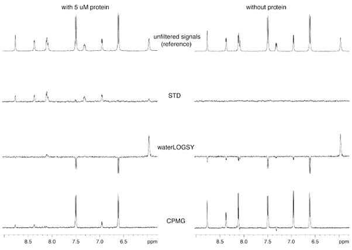

# Ligand Screening

 The purpose of this protocol is to Provide Instructions for sample preparation for Ligand screening. If needed ligand concentrations and [Protein Folding](../Folding Analysis/index.md) (see separate protocol) may be established by NMR in advance of using this guide.

## Prepare ligands for NMR

- [ ] Prepare stocks of all ligands in appropriate buffer (identical to Protein buffer). If a carrier such as DMSO is required, please request deuterated equivalent from the NMR facility to ensure compatibility.
- [ ] Ligands should be between 20-50x molar concentration of protein concentration so stocks should be 1-10mM. If concentration of ligand cannot easily be established (i.e. lack of intrinsic fluorescence or known mass) the concentration of the stock may be determined by NMR at this stage.

	>  Please specify to the Facility staff if this is required prior to planning experiment.

- [ ] Volume of ligand must be sufficient for multiple experiments (see below).

 

## Prepare protein for NMR

- [ ] For ligand screening, protein does not require any isotopic labelling (^15^N or ^13^C).
- [ ] Protein must be pure and in a buffer appropriate for NMR (phosphate buffer with <100mM NaCl). 
- [ ] Protein concentration should be 10-100 µM so a stock of 100 µM should be sufficient in a volume of 0.6 mL per ligand plus a ligand-free control.

 

## Perform protein control

1. Add 60 µL of ^2^H~2~O to 540 µL of protein at 20 µM concentration and transfer to a 5 mm outer diameter NMR tube before acquiring a standard 1D ^1^H NMR experiment. 
2. a peak visible in the protein that is more than 0.5 ppm from any ligand peaks and set the on-resonance frequency to this peak in STD and STDspinlock experiments. 

	> On-resonance frequency must be added to the frequency list (`FQLIST 2`) called stdtest which contains three lines - the first line is the field strength, the second line is the on-resonance frequency (in Hz) which should hit the protein but not the ligand (nor be within 100 Hz of a ligand signal), the third is the off-resonance frequency which should be far away from all signals (set to frequency equivalent to 15 ppm).

3. Acquire CPMG, WaterLOGSY, STD and STDspinlock experiments and check that protein signals are attenuated.

 

## Perform ligand control

1. Dilute ligand to concentration with matched buffer containing 10% ^2^H~2~O for experiment 400 µM for WaterLOGSY and 1 mM for Saturation Transfer Difference (STD).
2. Transfer 600 µL of ligand control to 5 mm outer diameter NMR tube.
3. Acquire standard 1D ^1^H NMR then CPMG, WaterLOGSY, STD and STDspinlock (as optimised in [Perform protein control](#Perform protein control)) experiments and check that ligand signals are identical to those in standard 1D ^1^H NMR.

## Perform ligand-protein experiment

1. Prepare a Ligand:Protein sample at concentrations of 400 µM:20 µM respectively.
2. Run CPMG and WaterLOGSY under identical conditions to those optimised in [Perform protein control](#Perform protein control) and [Perform ligand control](#Perform ligand control).
3. Prepare a Ligand:Protein sample at concentrations of 1000 µM:20 µM respectively.
4. Run STD and STDspinlock under identical conditions to those optimised in [Perform protein control](#Perform protein control) and [Perform ligand control](#Perform ligand control).

## Analyse results for ligand binding

Inspect ligand:protein spectra and compare directly to the ligand-free spectra to identify presence of ligand binding. An example of effect ligand:protein binding has on the standard ^1^H, STDspinlock, waterLOGSY and CPMG are shown in **Figure 1**.

**Figure 1** Example of effect of binding on ligand spectra.

## Notes

It is useful to also run a known binding partner to your protein to see how binding effects the spectra. The strength (affinity) of the interaction is proportional to the changes between ligand control and ligand:protein spectra so weak affinity complexes will result in more subtle effects.

Ligand mixtures may be used as opposed to one ligand at a time provided that:

- The ligand spectra are sufficiently distinct (typically require standard spectra for each in advance and realistically a maximum of 5 ligands in one mixture).
- Ligands do not bind to each other.
- All ligands are used at the same concentrations. 